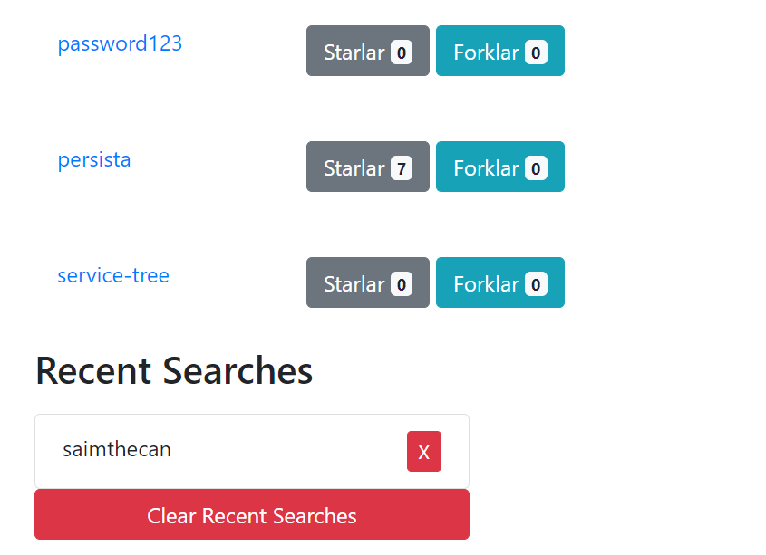

# Github Api

Sample web application created with HTML, CSS, JavaScript. Class method has been used in JavaScript. View profile information and repo information of Github users. 

## Features

* View github profile info and repos of a person you want
* View and clear search history

## App Demo

https://saimthecan-github-api.netlify.app/
